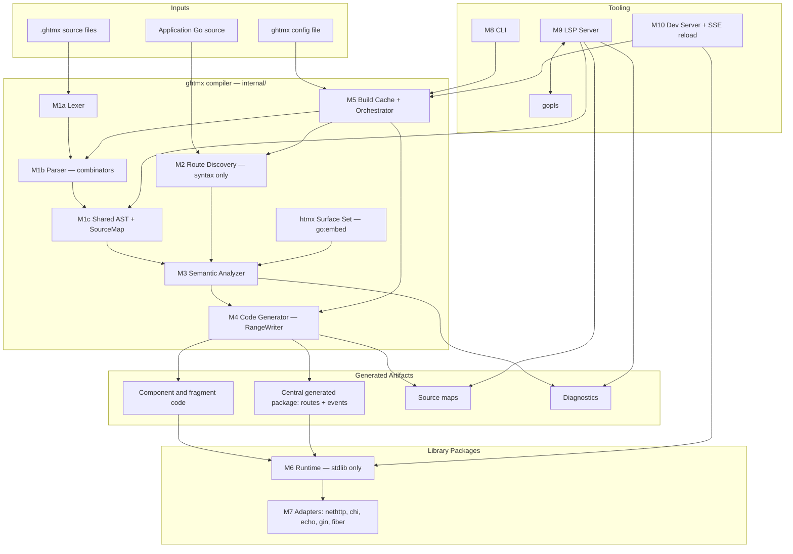
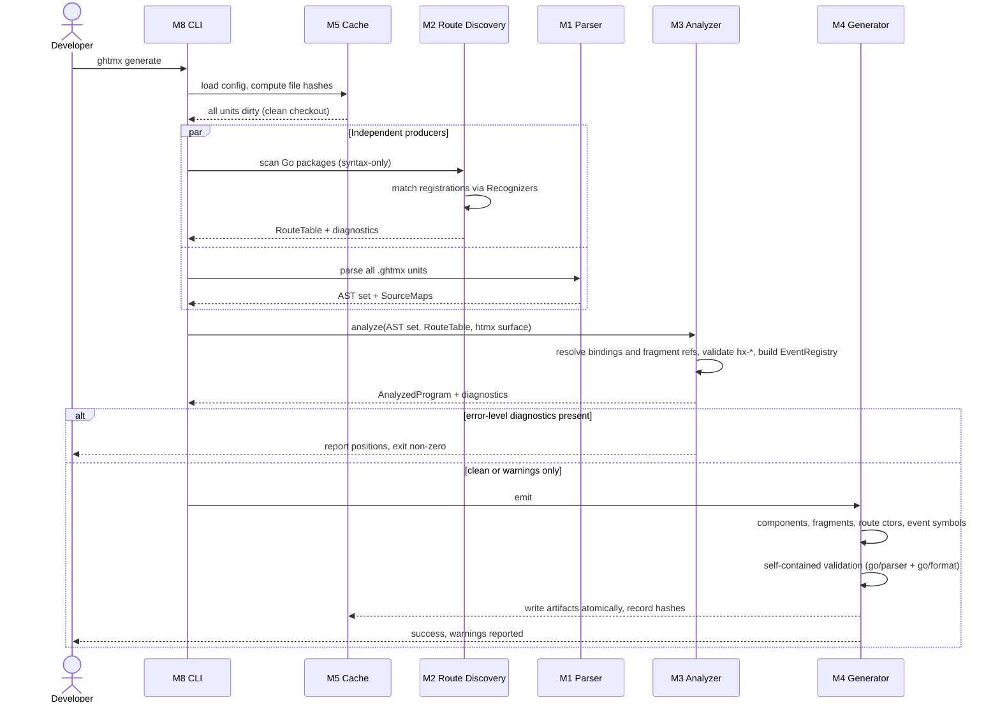
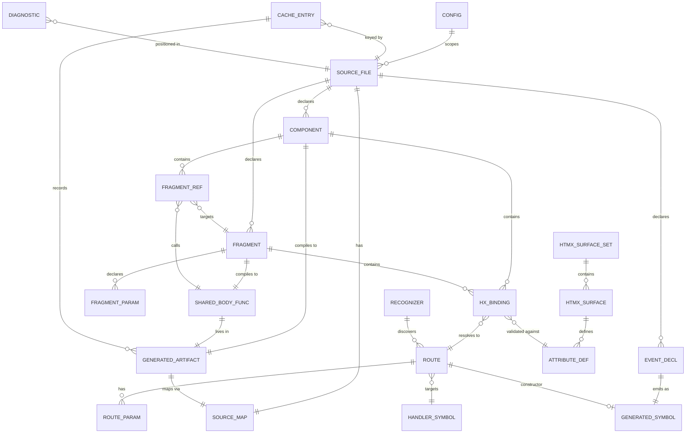

# Solution Design — Go HTMX (`.ghtmx`)

## Overview

### Description

`.ghtmx` is a compiled Go template engine that turns htmx from a set of string attributes into a statically-checked language feature. The compiler reads `.ghtmx` templates and the application's own Go source, derives a route table from the latter, and emits plain Go in which every htmx binding is resolved to a real URL at build time.

The architecture follows the `templ` project closely for the MVP — parser combinators over a shared position-carrying AST, a `RangeWriter`-style generator that collapses static markup into precomputed string literals, a bidirectional source map, and an LSP that proxies to `gopls` through that map. This is a deliberate choice: it is proven, it keeps the fork legible to upstream contributors, and it means the genuinely novel work is concentrated in three new subsystems rather than spread across a rewritten toolchain.

The three additions that make `.ghtmx` distinct from its upstream are:

1. **Route Discovery** — a syntax-only analysis pass over the application's Go source that produces the route table (verb, path, params, handler symbol) without requiring that source to compile.
2. **Semantic Analyzer** — resolves htmx bindings against the route table and validates `hx-*` attributes against an embedded, version-keyed htmx attribute surface.
3. **Fragment and event code generation** — dual render entry points per fragment, typed route constructors, and generated per-event emission symbols that make the `HX-Trigger` contract structurally enforceable. Fragment *rendering* is prior art: upstream provides it as a runtime facility that renders the whole page and discards the markup outside the selected fragments. The `.ghtmx` contribution is to move that selection to compile time, so a standalone swap executes only the fragment body and the parameter list is typed and checked (see D1 and D4).

### Technology Stack

| Layer | Choice | Rationale |
| --- | --- | --- |
| Language | Go (toolchain-supported range, documented) | Constitution: compiler, runtime, LSP, CLI all in Go |
| Parsing | Parser combinators, `templ`-style (`github.com/a-h/parse`) | Constitution A2 phase separation; proven on this exact grammar |
| Syntax baseline | Pinned `templ` syntax version, recorded in-repo as `TEMPL_SYNTAX_BASELINE` | FR-004 syntactic-superset guarantee; makes the target version explicit and diffable |
| Go source analysis | `golang.org/x/tools/go/packages` in syntax-only mode | Constitution A3.1 — no type-checking of user packages |
| Code generation | `RangeWriter`-style literal accumulation → `ghtmx.WriteString` | Matches upstream; minimises per-render write calls |
| Source mapping | Bidirectional `SourceMap` emitted alongside generated Go | NFR-009: every diagnostic resolves to original source |
| Runtime | Stdlib-only Go package; `sync.Pool` buffer pooling | NFR-012 import isolation, NFR-014 WASM compatibility |
| LSP | Own server proxying to `gopls` via the source map | FR-085 full Go intelligence without reimplementing `go/types` |
| Dev server | `net/http/httputil` reverse proxy, HTML-tokenizer-based script injection, gzip/brotli response decode-and-re-encode, SSE event channel | Mirrors `templ`'s live-reload transport, **including its skip of body modification for htmx requests** |
| htmx surface data | `go:embed` version-keyed surface set | Deterministic, offline, spans the supported htmx range |
| File watching | `fsnotify` | Upstream dependency baseline |
| Distribution | Single Go module; `go install` plus checksummed release binaries | Constitution A1 lockstep versioning |

### Design Decisions Summary

| # | Decision | Driver |
| --- | --- | --- |
| D1 | Follow `templ`'s parser, generator, and LSP architecture for the MVP | User directive; proven design; keeps fork legible |
| D2 | Route discovery is syntax-only and never requires the project to compile | Constitution A3.1; breaks the bootstrap circularity |
| D3 | Pluggable `Recognizer` interface, one implementation per router flavour | Extensibility without a rule-engine's opacity |
| D4 | Fragments compile to a shared body function plus two thin wrappers | Makes FR-031's byte-identical guarantee structural; enables cross-page reuse |
| D5 | Route constructors and event symbols live in one central generated package | Single import for consumers; global uniqueness enforceable |
| D6 | On-disk build cache keyed by content hash | Incremental watch mode that survives restarts |
| D7 | Bidirectional source map as a first-class artifact | Serves diagnostics, LSP proxying, and formatter alike |
| D8 | Version-keyed htmx attribute surface set, `go:embed`ded | Offline and deterministic while keeping the pinned version configurable |
| D9 | Enforcement delegated to the Go compiler wherever possible | Works within syntax-only analysis; zero false positives |
| D10 | Runtime is stdlib-only and `cgo`-free | NFR-012 and NFR-014 |
| D11 | Generate-time validation is self-contained; `go vet` is a CI gate | Reconciles P1/NFR-005 with the clean-checkout bootstrap |

## High-Level Architecture Design

The system is a single Go module producing one binary (`ghtmx`) plus importable library packages. Compiler internals live under `internal/` so they are structurally unable to leak into a consuming application's import graph — this is how NFR-012 is enforced rather than merely asserted.

Data flows in one direction through the compiler: source text becomes tokens, tokens become a shared AST, the AST plus the route table become an analyzed program, and the analyzed program becomes generated Go and a source map. Route discovery runs as an independent producer feeding the analyzer; it never consumes template state, which is what keeps it free of the bootstrap cycle.



### Generate sequence

The following shows a full `ghtmx generate` on a clean checkout — the case that must succeed with zero generated files present (FR-010).



## System Modules

### M1 — Parser, AST, and Source Map (`internal/lexer`, `internal/parser`, `internal/ast`, `internal/sourcemap`, `internal/format`)

**Responsibilities**

- Tokenize and parse `.ghtmx` into a single shared AST (constitution A4).
- **Parse the full inherited `templ` syntax surface at the pinned `TEMPL_SYNTAX_BASELINE` version** (FR-004), namely: element and text content, Go expression interpolation, `if`/`else`/`for`/`switch` control flow, typed component declarations, children/slot composition, dynamic and conditional attributes, attribute spreading, and scoped `css` and `script` blocks.
- Parse the `.ghtmx`-native additions: `fragment` declarations, **fragment references**, `event` declarations, and route-aware `hx-*` bindings.
- Carry precise source positions on every node.
- Build and maintain the bidirectional source map between `.ghtmx` and generated Go.
- Provide the canonical formatter, which round-trips through the same AST.

**Key Components**

- `Lexer` — position-tracking tokenizer over a `parse.Input`.
- Combinator parsers, one per construct (element, expression, `if`/`for`/`switch`, `component`, `fragment`, `fragmentref`, `event`, attribute, `css`, `script`).
- `ast` node set with `Range{From, To Position}` on every node; `Position{Index, Line, Col}`.
- `FragmentRef` node — a reference to a fragment declared elsewhere, carrying the target name, an optional package qualifier, and the argument expression list (FR-032).
- `SourceMap` with `SourceLinesToTarget` and `TargetLinesToSource` indices plus symbol-range entries.
- `Formatter` — AST-to-text writer guaranteeing idempotence (FR-062).

**Key Interfaces**

```go
type Parser interface {
    ParseFile(path string, src []byte) (*ast.TemplateFile, *sourcemap.SourceMap, []diag.Diagnostic)
}

type Node interface {
    Range() ast.Range
    Children() []Node
}

// A fragment referenced from a page other than the one declaring it.
type FragmentRef struct {
    Pkg  string        // optional package qualifier
    Name string
    Args []GoExpression
    Rng  ast.Range
}

func (m *SourceMap) TargetPositionFromSource(line, col int) (Position, bool)
func (m *SourceMap) SourcePositionFromTarget(line, col int) (Position, bool)
```

**Data Models** — `TemplateFile`, `Component`, `Fragment`, `FragmentRef`, `EventDecl`, `Element`, `Attribute`, `HxBinding`, `GoExpression`, `Range`, `Position`, `SourceMap`.

**Dependencies** — parser-combinator library only. No dependency on the route table, analyzer, or generator.

**Error Handling** — never panics (NFR-006); malformed input yields positioned diagnostics. The parser performs error recovery at element and declaration boundaries so a single bad construct does not suppress diagnostics for the rest of the file. Fuzz corpora are maintained in-repo and every crash found becomes a permanent regression case.

### M2 — Route Discovery (`internal/routes`, `internal/routes/recognizer`)

**Responsibilities**

- Build the `RouteTable` from application Go source **without type-checking it** (constitution A3.1).
- Recognize registration forms across `net/http`, chi, echo, gin, and fiber.
- Compose group and nested prefixes; see through middleware wrapping.
- Merge escape-hatch declarations and detect conflicts.

**Key Components**

- `Loader` — `go/packages` configured to `NeedName | NeedFiles | NeedSyntax` only. Type information is never requested; a package that fails to type-check is irrelevant to this pass.
- `Recognizer` implementations, one per router flavour (D3). Each inspects a call expression and decides whether it is a route registration.
- `PrefixResolver` — walks group/`Route`/`Group` nesting, accumulating literal path prefixes.
- `MiddlewareUnwrapper` — sees through `With(...)`-style chains to the underlying registration.
- `ConflictDetector` — verb+path uniqueness across discovered and declared routes.

**Key Interfaces**

```go
// One implementation per router flavour. Internal in the MVP;
// third-party routers are supported by contributing a Recognizer upstream.
type Recognizer interface {
    Name() string
    // Detect reports whether this call is a route registration and, if so,
    // extracts it. ok=false means "not mine"; a diagnostic means
    // "mine, but unresolvable".
    Detect(call *goast.CallExpr, ctx *ScopeContext) (Registration, []diag.Diagnostic, bool)
    // ParamSyntax normalizes this router's path parameter form.
    ParamSyntax() ParamStyle // Brace ("{id}") or Colon (":id")
}

type RouteTable interface {
    Lookup(verb Verb, symbol SymbolRef) (Route, bool)
    ByHandler(symbol SymbolRef) []Route
    All() []Route
}
```

**Data Models** — `Route`, `RouteParam`, `SymbolRef{PkgPath, Name}`, `Registration`, `ParamStyle`, `RouteOrigin{Discovered|Declared}`.

**Dependencies** — `golang.org/x/tools/go/packages`, `go/ast`, `go/parser`. No dependency on M1 or M3.

**Error Handling** — a package that fails to parse produces a diagnostic and is skipped; analysis continues over the remainder (FR-055). A registration a `Recognizer` claims but cannot resolve statically produces a positioned error directing the author to the escape-hatch annotation (FR-051). Handler symbol resolution is by package-qualified identifier matching against file import declarations — no type resolution is available or assumed.

### M3 — Semantic Analyzer (`internal/analyzer`, `internal/htmxsurface`)

**Responsibilities**

- Resolve every htmx binding against the route table; enforce verb agreement.
- Resolve fragment references, including across packages (FR-032).
- Validate `hx-*` attribute names, values, and combinations against the configured htmx version.
- Report the FR-004 carve-outs with dedicated, actionable diagnostics.
- Build the `EventRegistry` from `event` declarations and enforce name uniqueness.
- Detect circular component/fragment references, dangling swap targets, unused fragments, unreachable routes.
- Produce the `AnalyzedProgram` consumed by the generator.

**Key Components**

- `BindingResolver` — maps `hx-post={ handlers.CreateUser }` and `hx-get={ routes.GetUser(id) }` to `Route` entries.
- `FragmentRefResolver` — resolves each `FragmentRef` to its declaring `Fragment`, checks argument arity against the fragment's declared parameter list, and enforces Go visibility rules for cross-package references. An unresolvable reference is a positioned error naming the fragment.
- `AttributeValidator` — checks against the `htmxsurface.Surface` selected for the configured version; supplies did-you-mean suggestions from the same table.
- `CarveOutReporter` — detects the two FR-004 semantic carve-outs and reports them specifically rather than as generic parse or type errors: (a) an `hx-*` attribute given an arbitrary string value where a typed binding is required, and (b) author-selected URL escaping at a route-binding site. Each diagnostic names the carve-out and the `.ghtmx` construct that replaces the `templ` idiom.
- `EventRegistryBuilder` — collects `event` declarations, enforces global uniqueness, assigns generated symbol names.
- `TargetChecker` — literal-to-literal ID matching only; any interpolated selector or emitted ID is exempt from analysis entirely (FR-042).
- `CycleDetector` — deterministic DFS over the component/fragment reference graph, including `FragmentRef` edges.
- `DiagnosticSink` — accumulates diagnostics with stable IDs and severities.

**Key Interfaces**

```go
type Analyzer interface {
    Analyze(files []*ast.TemplateFile, rt routes.RouteTable, s htmxsurface.Surface, cfg Config) (*AnalyzedProgram, []diag.Diagnostic)
}

type Diagnostic struct {
    ID       string        // stable, e.g. "GHTMX-E0102"
    Severity Severity      // Error | Warning
    Pos      sourcemap.Position
    Message  string
    Suggest  string
}

// Surface is selected from the embedded set by configured htmx version (D8).
type Surface interface {
    Version() string
    Attribute(name string) (AttributeDef, bool)
    ValidateCombination(attrs []string) []Conflict
    // Introduced/Removed drive the FR-052 message contract.
    Introduced(name string) (version string, ok bool)
    Removed(name string) (version string, ok bool)
}

type SurfaceSet interface {
    ForVersion(v string) (Surface, error) // error names the supported range
    SupportedVersions() []string
}
```

**Data Models** — `AnalyzedProgram`, `ResolvedBinding`, `ResolvedFragmentRef`, `EventRegistry`, `EventDef`, `AttributeDef`, `Conflict`, `Diagnostic`.

**Dependencies** — M1 (AST), M2 (route table), embedded htmx surface set. No dependency on M4.

**Error Handling** — analysis is accumulative, never fail-fast: all diagnostics for a run are collected so the LSP and CLI report a complete set. Severity is data, not control flow — the same check emits a warning or an error depending on configuration (FR-042 strict mode, FR-071). Generation is skipped entirely if any error-level diagnostic exists, so no partial or invalid output is ever written (constitution P1).

### M4 — Code Generator (`internal/generator`)

**Responsibilities**

- Emit component, fragment, route constructor, and event emission code.
- Produce deterministic, `gofmt`-clean Go that satisfies `go vet` under the CI gate (NFR-004, NFR-005).
- Emit the source map alongside each generated file.

**Key Components**

- `RangeWriter` — accumulates consecutive static markup into a single string literal and flushes it as one `ghtmx.WriteString(buf, idx, "…")` call; records the target `Range` of every write for the source map.
- `ComponentEmitter` — components become exported Go functions returning `ghtmx.Component`.
- `FragmentEmitter` — implements D4: one unexported body function per fragment, plus two thin wrappers (see API section). A `ResolvedFragmentRef` from any page emits a call to the *same* shared body, so a fragment referenced by several pages is compiled exactly once.
- `RouteEmitter` — typed constructors into the central generated package (D5).
- `EventEmitter` — one exported emission symbol per declared event.
- `EscapeResolver` — selects the escaper at compile time from the output context, so the runtime calls a specific escaper rather than dispatching.
- `SelfValidator` — see Error Handling: parses and formats emitted content with `go/parser` and `go/format` before writing.

**Key Interfaces**

```go
type Generator interface {
    Generate(p *analyzer.AnalyzedProgram, out Sink) ([]Artifact, error)
}

type RangeWriter interface {
    WriteLiteral(s string) error          // accumulates
    WriteExpr(goExpr string, ctx EscapeContext) error // flushes, then emits
    Flush() error
    Range() sourcemap.Range
}
```

**Data Models** — `Artifact{Path, Content, SourceMap}`, `EscapeContext`, `GeneratedSymbol`.

**Dependencies** — M3 output, `go/parser`, `go/format`. Emission order is fully determined by AST order and sorted symbol names; no map iteration reaches the output (NFR-004).

**Error Handling — two-phase validation (D11).** Validation is split by what is actually knowable at each point:

- **Generate time — self-contained checks only.** Emitted content is parsed with `go/parser` and formatted with `go/format`. Both operate on a single file and require no package context, so they work on a clean checkout where handler packages do not yet type-check. Failure is an internal-defect diagnostic; nothing is written. Successful output is written atomically.
- **CI — full checks.** `go vet` and full compilation run over the golden-file corpus and the fixture applications, where the package context is complete and every generated file is present. This is the enforcement point for NFR-005 and for the `go vet` clause of constitution P1.

Running `go vet` at generate time is explicitly rejected: it type-checks whole packages, which contradicts the syntax-only premise (D2) and would fail on the flagship clean-checkout bootstrap case (SC-13).

### M5 — Build Cache and Orchestrator (`internal/cache`, `internal/build`)

**Responsibilities**

- Drive the pipeline for `generate`, `watch`, and the dev server.
- Provide incremental rebuilds via an on-disk content-hash cache (D6).
- Parallelize independent work within the sub-1s regeneration budget (NFR-001).

**Key Components**

- `HashStore` — on-disk cache keyed by SHA-256 of file content plus a compiler-version salt, so a toolchain upgrade invalidates everything.
- `DependencyGraph` — template-to-template (including fragment references), template-to-route, and template-to-event dependencies.
- `Invalidator` — two-tier: a change to Go source in discovery scope invalidates the route table and every unit with a binding; a change to a `.ghtmx` file invalidates that unit and its dependents, which for a fragment includes every page referencing it.
- `WorkerPool` — bounded parallel parse and emit across units.

**Key Interfaces**

```go
type Builder interface {
    Build(ctx context.Context, mode Mode) (Result, []diag.Diagnostic)
}

type Cache interface {
    Get(key Key) (Entry, bool)
    Put(key Key, e Entry) error
    Invalidate(paths []string) []Unit
}
```

**Data Models** — `Unit`, `Key{ContentHash, ToolchainVersion, ConfigHash}`, `Entry{Artifacts, Diagnostics, Deps}`, `Result`.

**Dependencies** — M1–M4, `fsnotify` for watch mode.

**Error Handling** — the cache is an optimization and never a correctness dependency: a corrupt or unreadable entry is discarded and the unit rebuilt. A cache miss is never an error. Stale-output detection (FR-054) compares recorded hashes against on-disk artifacts and reports drift with a non-zero exit code in check mode.

### M6 — Runtime Library (root package `ghtmx`)

**Responsibilities**

- Define the component contract and rendering primitives.
- Provide contextual escaping, htmx response header helpers, event emission plumbing, CSRF helpers, and the script-inclusion helper.

**Key Components**

- `Component` interface and `ComponentFunc` adapter.
- Buffer pool (`sync.Pool`) with `GetBuffer`/`ReleaseBuffer`; when the target is already a buffered writer the pool is bypassed.
- `WriteString(buf, index, literal)` — the single write primitive the generator targets.
- Escapers: `EscapeString`, `EscapeAttribute`, `EscapePathSegment`, `EscapeQueryValue`, `SanitizeCSS`, JS-context escaper.
- `Headers` — typed `HX-Retarget`, `HX-Reswap`, `HX-Redirect`, and `HX-Trigger` accumulation.
- `CSRF` — token attachment helper for state-changing verbs.
- `Error` type carrying `FileName`, `Line`, `Col`.

**Key Interfaces**

```go
package ghtmx

type Component interface {
    Render(ctx context.Context, w io.Writer) error
}

type ComponentFunc func(ctx context.Context, w io.Writer) error

// Fragment carries both render modes; generated wrappers satisfy it.
type Fragment interface {
    Component                                    // full-page / inline render
    RenderFragment(ctx context.Context, w io.Writer) error // standalone
}
```

**Data Models** — `Component`, `Fragment`, `Attributes`, `SafeURL`, `TriggerEvent`, `Error`.

**Dependencies** — **standard library only.** No `cgo`. This is enforced by an automated CI check on the package's transitive import set (NFR-012) and is what makes NFR-014's WASM builds achievable.

**Error Handling** — render errors are returned, never panicked, and propagate to the caller. A partially-written response is the caller's to handle; the runtime never sets an HTTP status code on the explicit-render path (FR-034).

### M7 — Framework Adapters (`adapters/nethttp`, `adapters/chi`, `adapters/echo`, `adapters/gin`, `adapters/fiber`)

**Responsibilities**

- Provide opt-in automatic render-mode selection (FR-035).
- Bridge framework-specific context types to the runtime's writer-based API.

**Key Components** — per framework: a `Render` helper that inspects `HX-Request`, selects the mode, sets status and htmx headers, and delegates to the runtime. The fiber adapter additionally bridges its non-`http.ResponseWriter` context.

**Key Interfaces**

```go
// Illustrative; each adapter mirrors this shape in its framework's idiom.
func Render(w http.ResponseWriter, r *http.Request, f ghtmx.Fragment, opts ...Option) error
func Status(code int) Option
func Retarget(sel string) Option
```

**Data Models** — `Option`, `RenderMode{Full|Standalone}`.

**Dependencies** — M6 plus the respective framework. **Core packages depend on no adapter** (constitution A5); an application importing zero adapters is fully supported.

**Error Handling** — adapters return the runtime's error unchanged. Automatic mode selection is never active unless explicitly opted into; the core runtime performs no implicit header inspection.

### M8 — CLI (`cmd/ghtmx`)

**Responsibilities** — expose `generate`, `watch`, `fmt`, `routes`, and the dev server; own configuration resolution and exit-code semantics.

**Key Components** — command tree; `ConfigResolver` implementing flag > file > default precedence (FR-073); `DiagnosticReporter` with human and machine-readable (JSON) output modes.

**Key Interfaces**

```
ghtmx generate [--strict-targets] [--check]
ghtmx watch [--proxy <addr>]
ghtmx fmt [--check]
ghtmx routes [--json]
```

**Data Models** — `Config` (DATA-008), `ExitCode`.

**Dependencies** — M5, M9, M10.

**Error Handling** — exit non-zero on any error-level diagnostic; warnings alone never fail a run (FR-060). `--check` modes write nothing and signal via exit code, for CI use.

### M9 — LSP Server (`internal/lsp`, `internal/lsp/goplsproxy`)

**Responsibilities** — serve diagnostics, completion, hover, and go-to-definition for `.ghtmx`; delegate embedded-Go intelligence to `gopls`.

**Key Components**

- `Server` — LSP endpoint consuming the shared AST (never a second parser, per A4).
- `GoplsLocator` — resolves the `gopls` binary from `PATH` and the Go bin directories and detects its version, so an absent or incompatible `gopls` degrades to `.ghtmx`-only features with a reported message rather than failing the session. Mirrors upstream.
- `GoplsProxy` — spawns and supervises `gopls`, forwarding requests for embedded Go regions.
- `SourceMapCache` and `DiagnosticCache` — per-URI caches of the generated-Go source map and the last published diagnostic set. The diagnostic cache is what allows `gopls`-originated diagnostics to be translated back to `.ghtmx` positions and merged with the analyzer's own set before republishing, without re-running analysis.
- `PreloadPolicy` — by default the server warms the workspace at startup by generating in-memory Go for every `.ghtmx` file, so cross-file navigation works on first request. A documented no-preload mode disables this for large monorepos where warm-up cost outweighs first-request latency (NFR-003).
- `PositionTranslator` — rewrites positions in both directions across the source map: `.ghtmx` → generated Go on the way out, generated Go → `.ghtmx` on the way back.
- `RouteCompletionProvider` and `EventCompletionProvider` — driven by the route table and event registry.
- `SurfaceCompletionProvider` — `hx-*` names and values for the configured htmx version.

**Key Interfaces**

```go
type PositionTranslator interface {
    ToTarget(uri string, p Position) (Position, bool)
    ToSource(uri string, p Position) (Position, bool)
}
```

**Data Models** — document store keyed by URI holding text, AST, source map, and diagnostics.

**Dependencies** — M1, M3, M5; `gopls` as an external process.

**Error Handling** — a `gopls` crash degrades embedded-Go features but MUST NOT take down `.ghtmx` diagnostics; the proxy restarts it with backoff. A position that does not map is dropped rather than reported at a wrong location — a wrong position is worse than a missing feature (NFR-009).

### M10 — Dev Server and Live Reload (`internal/devserver`)

**Responsibilities** — serve the application during development and refresh the browser after a clean regeneration.

**Key Components** — following `templ`'s live-reload transport, verified against the upstream proxy implementation:

- `ReverseProxy` — sits in front of the user's application. Reserved paths are served locally and never forwarded upstream.
- `HtmxSkipFilter` — **suppresses response-body modification entirely for htmx-initiated requests** (`HX-Request`), as upstream does. This is load-bearing here rather than incidental: in an htmx-first engine most dev-loop responses are partials, and injecting a reload script into a swapped fragment would corrupt the fragment's markup and duplicate the script on every swap.
- `ScriptInjector` — injects the reload script into full-page HTML responses by tokenizing the document rather than pattern-matching it, decoding and re-encoding gzip- or brotli-compressed bodies around the injection, and propagating any Content-Security-Policy nonce on the response to the injected tag. A response it cannot safely modify is forwarded unchanged.
- `SSEHub` — serves the reload event stream at a reserved path and fans out reload events to connected clients.

**Key Interfaces**

```
GET /_ghtmx/reload/events   →  text/event-stream
event: reload
data: <build-id>
```

**Data Models** — `BuildID`, `ReloadEvent`.

**Dependencies** — M5 (build results), `net/http/httputil`.

**Error Handling** — a reload event is emitted **only** after a regeneration with no error-level diagnostics. A failed regeneration leaves the previous good build serving and surfaces diagnostics to the terminal (FR-063).

## Data Model



### Entity descriptions

**CONFIG** — resolved project configuration: pinned htmx version, source directories, route-discovery scope, output package, generated-file naming, per-check severities. Its hash participates in the cache key so a config change invalidates output.

**SOURCE_FILE** — a `.ghtmx` file or an analyzed Go file. Carries path, content hash, and parse status.

**SOURCE_MAP** — bidirectional index between `.ghtmx` ranges and generated-Go ranges. Consumed by diagnostics, the LSP proxy, and the formatter.

**COMPONENT / FRAGMENT** — declared template units. A `FRAGMENT` owns `FRAGMENT_PARAM` entries defining the parameter list shared by both generated entry points, and compiles to exactly one `SHARED_BODY_FUNC`.

**FRAGMENT_REF** — a reference from any component (page) to a fragment declared elsewhere, carrying an optional package qualifier and argument expressions. Many refs may target one fragment; this is the mechanism behind cross-page composability (FR-032). Argument arity and cross-package visibility are checked by M3.

**SHARED_BODY_FUNC** — the single unexported body emitted per fragment (D4). Both generated wrappers and every `FRAGMENT_REF` call it, which is what makes the standalone entry point independent of which page references the fragment.

**EVENT_DECL** — an `event` declaration: name, payload type, declaring position. Names are globally unique across the compiled set; a collision is a compile error.

**HX_BINDING** — an occurrence of a route-aware `hx-*` attribute. Resolves to exactly one `ROUTE` and is validated against one `ATTRIBUTE_DEF`.

**ROUTE** — verb, normalized path pattern, original router flavour, origin (discovered or declared), and registration source position. Uniqueness is on verb + path.

**ROUTE_PARAM** — an ordered path parameter: name, position in the path, and declared type. Type defaults to `string` unless annotated, since syntax-only analysis cannot infer it.

**HANDLER_SYMBOL** — `{PkgPath, Name}`, resolved by identifier matching against import declarations rather than type resolution.

**RECOGNIZER** — the router-flavour matcher that produced a route. Recorded for diagnostics and for the `routes` command's output.

**GENERATED_SYMBOL** — an exported Go symbol the compiler emits: a route constructor or an event emitter. It is the *only* means of invoking the corresponding capability, which is what makes enforcement structural (D9).

**GENERATED_ARTIFACT** — an emitted `.go` file with its content and source map. Deterministic and `gofmt`-clean by construction.

**HTMX_SURFACE_SET / HTMX_SURFACE / ATTRIBUTE_DEF** — the embedded, version-keyed surface set (D8). The set spans the supported htmx version range; one `HTMX_SURFACE` is selected per build from `CONFIG`'s pinned version. Each `ATTRIBUTE_DEF` records permitted values, invalid combinations, and **introduced-in / removed-in** version metadata, which is what makes the FR-052 message contract constructible.

**CACHE_ENTRY** — content-hash-keyed record of a unit's artifacts, diagnostics, and dependencies. Purely an optimization; discardable at any time.

**DIAGNOSTIC** — stable ID, severity, position, message, optional suggestion.

## API / Protocol Design

### Generated code contracts

These shapes are the public contract between the compiler and application code. They are what application developers write against.

**Component** — a component becomes an exported function returning a `Component`:

```go
func UserCard(u User) ghtmx.Component
```

**Fragment (D4)** — one shared body, two thin wrappers, so byte-identical output is structural rather than tested-for. Every page that references the fragment calls the same body:

```go
// Shared body — emitted once per fragment, unexported.
// Called by the fragment's own wrappers and by every referencing page.
func userRow_body(ctx context.Context, w io.Writer, u User) error

// Inline wrapper — used when rendering the fragment as part of a page.
func UserRow(u User) ghtmx.Component

// Standalone wrapper — called by a handler for an htmx swap.
// Accepts exactly the fragment's declared parameter list, and is
// independent of which page references the fragment.
func UserRowFragment(u User) ghtmx.Fragment
```

**Route constructor (D5)** — emitted into the central generated package:

```go
package ghtmxgen // configurable

const CreateUserPath = "/users"                 // non-parameterised
func GetUser(id string) ghtmx.SafeURL           // parameterised, URL-escaped
func DeleteUser(id string) ghtmx.SafeURL
```

**Event emitter (FR-037, D9)** — the only way to emit an event; an undeclared event simply has no symbol, so the Go compiler rejects it at the call site:

```go
type UserCreatedPayload struct{ ID string; Name string }

func EmitUserCreated(w http.ResponseWriter, p UserCreatedPayload) error
```

Multiple emissions in one response accumulate into a single correctly-serialized `HX-Trigger` header.

### Runtime API

```go
func WriteString(w io.Writer, index int, s string) error
func GetBuffer(w io.Writer) (*bytes.Buffer, bool)
func ReleaseBuffer(b *bytes.Buffer)
func EscapeString(s string) string
func EscapePathSegment(s string) string
func EscapeQueryValue(s string) string
func Script(opts ...ScriptOption) Component   // htmx script tag, version-validated
func WithCSRF(token string) AttributeOption   // hx-headers CSRF attachment
```

### Extension interface

`Recognizer` (M2) is the extension point for router support. In the MVP it is **internal**: adding a router means contributing an implementation upstream, not registering one from a third-party module. This is a deliberate scope limit — see Key Solution Decisions.

### Dev server protocol

Reverse proxy in front of the application; HTML responses receive an injected reload script; reload events are delivered over SSE on a reserved path (`/_ghtmx/reload/events`) as `event: reload` with the build ID as data. Reserved paths are never forwarded upstream.

### LSP protocol surface

`textDocument/publishDiagnostics`, `completion`, `hover`, `definition`, `formatting`, `didOpen`/`didChange`/`didSave`. Requests touching embedded Go regions are translated through the source map, forwarded to `gopls`, and translated back.

### Diagnostic identifiers and error codes

Every diagnostic carries a stable ID so severities can be configured individually (FR-045, FR-071).

| Range | Meaning | Examples |
| --- | --- | --- |
| `GHTMX-E01xx` | Route binding errors | unknown handler, verb mismatch, wrong constructor arity |
| `GHTMX-E02xx` | Attribute errors | unknown `hx-*`, invalid value, contradictory combination |
| `GHTMX-E03xx` | Declaration errors | duplicate fragment, duplicate event, circular reference, unresolvable fragment reference |
| `GHTMX-E04xx` | Route discovery errors | duplicate route, statically unresolvable registration |
| `GHTMX-E05xx` | Version errors | htmx version mismatch, configured version outside the embedded supported range |
| `GHTMX-E06xx` | `templ` carve-out errors (FR-004) | `hx-*` given an arbitrary string where a typed binding is required; author-selected URL escaping at a binding site. Each names the carve-out and its `.ghtmx` replacement construct |
| `GHTMX-W01xx` | Reachability warnings | unused fragment, unreachable route, unemitted event |
| `GHTMX-W02xx` | Target warnings | dangling swap target (error under strict mode) |
| `GHTMX-W03xx` | Build hygiene warnings | stale generated output |

## Security Architecture

### Authentication and Authorization

The engine has **no authentication or authorization model**. It renders HTML; it does not own sessions, identity, or permissions, and it never inspects credentials. Access control belongs entirely to the application. This is an explicit architectural boundary: no future feature may introduce an identity concept into the runtime without amending the constitution.

What the engine does provide is **CSRF safety for state-changing htmx requests** (S2): a helper attaches an application-supplied token via `hx-headers` for `hx-post`, `hx-put`, `hx-patch`, and `hx-delete`, so making a binding CSRF-safe never requires hand-written header plumbing. The engine neither generates nor validates tokens.

### Input Validation

Validation is layered, and the outermost layer is the compiler:

- **Compile-time.** `hx-*` names, values, and combinations are validated against the embedded surface for the configured htmx version. Unresolvable bindings, verb mismatches, unresolvable fragment references, and undeclared events fail the build. This eliminates a class of injection surface by removing hand-written URL strings from templates entirely.
- **Context-aware escaping (S1).** The escaper is chosen at *compile time* from the output context — HTML text, attribute, URL, JS, CSS — and the runtime calls that specific escaper directly. There is no runtime context dispatch to get wrong, and no global switch to disable escaping.
- **Route-binding URLs (S1.1).** Parameters interpolated into a generated `hx-*` URL are percent-encoded by the engine according to their position (path segment vs. query value), then composed with attribute-value escaping. The context is derived from the attribute's declared type and is **not overridable at the binding site** — the `CarveOutReporter` rejects attempts to do so with a specific diagnostic rather than silently honouring them.
- **Explicit unsafe.** Bypassing escaping requires a visibly-named construct at the call site.

Out of scope for the MVP, and documented as such: URL scheme allow-listing (`javascript:`/`data:` rejection) and OOB swap validation.

### Data Protection

- **No data at rest.** The engine persists no user data and processes no PII. The only artifacts written are generated Go, source maps, and the build cache — all derived from the user's own source.
- **Supply chain.** `govulncheck` gates every CI build (S3). The dependency baseline is inherited from `templ` and additions require justification.
- **No network at build time.** The htmx attribute surface set is `go:embed`ded (D8), so `generate` performs no network I/O — deterministic, offline-capable, and free of a build-time fetch as an attack surface.
- **Reproducibility as an integrity property.** Byte-identical output for identical input (NFR-004) means generated code is reviewable in diffs, so a malicious or accidental change to emitted code is visible.
- **Release integrity.** Artifacts are checksummed and versioned in lockstep across compiler, runtime, LSP, and adapters.

## Deployment & Operations

### Infrastructure Layout

There is no server-side infrastructure — this is a compiler and a library. Three deployment surfaces exist:

1. **Developer machine.** The `ghtmx` binary (CLI, LSP, dev server) plus editor extensions. Installed via `go install` or a checksummed release binary.
2. **CI.** The same binary invoked as `ghtmx generate --check` and `ghtmx fmt --check`, plus the test, `go vet`, compilation, and benchmark suites.
3. **Production.** Nothing of `ghtmx` ships except the **runtime package**, compiled into the user's application binary. The compiler, LSP, and dev server are never present in production.

```
ghtmx/                        module root — package ghtmx (runtime, stdlib-only)
├── cmd/ghtmx/                CLI entrypoint
├── adapters/{nethttp,chi,echo,gin,fiber}/
└── internal/                 compiler internals — structurally unimportable
    ├── lexer/ parser/ ast/ sourcemap/ format/
    ├── routes/ routes/recognizer/
    ├── analyzer/ htmxsurface/
    ├── generator/ cache/ build/
    ├── lsp/ lsp/goplsproxy/
    └── devserver/
```

Placing every compiler package under `internal/` is what makes NFR-012 structural: a consuming application *cannot* import them, so tooling dependencies cannot reach its import graph.

### Scaling Strategy

"Scale" here means project size and edit-loop responsiveness, not traffic:

- **Parallel unit processing.** Parsing and emission are per-unit and independent; a bounded worker pool sized to `GOMAXPROCS` keeps full regeneration inside the 1s budget for ~100 templates (NFR-001).
- **Two-tier incremental invalidation.** A `.ghtmx` edit rebuilds that unit and its dependents — for a fragment, that includes every page referencing it. A Go edit within discovery scope rebuilds the route table and any unit with a binding. Most edits touch one unit.
- **Persistent on-disk cache (D6).** Content-hash keyed, salted with the toolchain version, so it survives editor and CI restarts and invalidates wholesale on upgrade.
- **LSP warm state.** The server holds parsed ASTs and the route table in memory and updates incrementally per keystroke, which is what makes the 100ms budget (NFR-003) reachable; `gopls` maintains its own warm state alongside.
- **Route discovery cost.** Syntax-only loading is dramatically cheaper than type-checking — the same property that breaks the bootstrap cycle also keeps this pass off the critical path.

### Configuration

- **Config file at the module root**, covering pinned htmx version, source directories, route-discovery scope, output package, generated-file naming, and per-check severities.
- **Convention over configuration**: a conventional layout requires no config file at all.
- **Precedence: flag > config file > default**, documented, with every setting flag-addressable for CI and scripting.
- **Config hash participates in the cache key**, so a configuration change correctly invalidates generated output.
- **htmx version selection** resolves against the embedded surface set; a version outside the supported range is a `GHTMX-E05xx` error naming the supported range.

## Observability

Observability targets the developer and CI, not a running service.

- **Diagnostics** — every diagnostic carries a stable ID, severity, position, message, and optional suggestion. A JSON output mode makes them machine-consumable by CI and editors.
- **Build timing** — a verbose mode reports per-phase timing (parse, discovery, analyze, emit) plus cache hit/miss counts, so a breach of NFR-001 is immediately attributable to a phase.
- **`routes` command** — prints the discovered route table with origin, recognizer, and source position; the primary tool for debugging why a binding did not resolve.
- **LSP logging** — structured server logs including `gopls` proxy health and restart events.
- **Benchmark reporting** — CI publishes render and compile figures against the recorded baseline on every run, so drift is visible before it breaches the 5% gate.

## Testing Strategy

| Strategy | Scope | Gate |
| --- | --- | --- |
| Golden-file codegen snapshots | Every language construct: `.ghtmx` → expected `.go` | Any drift fails CI |
| `templ` conformance corpus | Constructs valid at `TEMPL_SYNTAX_BASELINE`, minus the documented FR-004 carve-out exclusions | All non-excluded cases parse and render equivalently; every exclusion is listed and produces a `GHTMX-E06xx` diagnostic |
| Spec-driven examples | Every language feature has a passing spec example before merge | Merge blocker |
| Fuzzing | Lexer and parser | No panic on any input; crashes become regression cases |
| Rendering conformance | Escaping in every context; both fragment render modes | Expected-HTML comparison |
| Fragment composition fixtures | One fragment referenced by two pages, plus cross-package reference | Single shared body emitted; standalone output identical from either page |
| Route discovery fixtures | Per-router registration, groups, middleware, conflicts | Expected route table comparison |
| Benchmarks | Render throughput, compile time | ≤5% regression vs. recorded baseline |
| LSP protocol tests | Completion, hover, diagnostics, definition + latency | <100ms assertion |
| Generated code validity | `go vet` + full compilation over golden corpus and fixture apps | Zero findings (D11 CI-phase gate) |
| WASM build matrix | Fixture app (runtime + generated code + chi) | Zero errors on `js/wasm` and `wasip1/wasm` |
| Import isolation check | Runtime package transitive imports | Stdlib-only assertion |
| Determinism check | Regenerate and diff | Byte-identical output |
| End-to-end reference app | CRUD with htmx partials | Builds and runs with zero hand-written glue |

## Success Criteria

| # | Criterion | Target | Traces to |
| --- | --- | --- | --- |
| SC-1 | Reference CRUD app builds and runs with zero hand-written htmx glue | Pass/fail | MVP success criterion |
| SC-2 | Full project regeneration | < 1s for ~100 templates | NFR-001 |
| SC-3 | Render throughput vs. recorded baseline | ≤ 5% regression | NFR-002 |
| SC-4 | LSP completion and diagnostics latency | < 100ms | NFR-003 |
| SC-5 | Generated output determinism | 100% byte-identical | NFR-004 |
| SC-6 | Generated code validity | 100% `gofmt`-clean and parseable at generate time; 100% `go vet`-clean and compiling under the CI gate (D11) | NFR-005 |
| SC-7 | Parser robustness | Zero panics under continuous fuzzing | NFR-006 |
| SC-8 | Escaping correctness | 100% conformance suite pass, all contexts | NFR-007 |
| SC-9 | Diagnostic precision | 100% carry `file:line:col` to original source | NFR-009 |
| SC-10 | Host portability | Linux, macOS, Windows green | NFR-010 |
| SC-11 | Runtime import isolation | Stdlib-only transitive set | NFR-012 |
| SC-12 | WASM build compatibility | Zero errors, `js/wasm` and `wasip1/wasm` | NFR-014 |
| SC-13 | Clean-checkout bootstrap | Single-pass `generate` succeeds with zero generated files present | FR-010 |
| SC-14 | Route binding safety | Zero runtime 404s from resolvable-at-build-time bindings | Constitution P2 |
| SC-15 | Dependency vulnerability posture | `govulncheck` clean, or every finding explicitly accepted with recorded rationale | NFR-008 |
| SC-16 | Toolchain integration | Standard `go build` consumes output with no step beyond `ghtmx generate`; no `cgo`, no Node/npm in the core workflow | NFR-011 |
| SC-17 | Language feature coverage | 100% of language features have a passing specification example | NFR-013 |
| SC-18 | `templ` syntax superset | 100% of the non-excluded conformance corpus passes; every exclusion documented with its replacement construct | FR-004 |

## Key Solution Decisions

### D1 — Follow `templ`'s architecture for the MVP

**Decision.** Parser combinators, `RangeWriter` generation, bidirectional source map, and a `gopls`-proxying LSP — all mirroring upstream.

**Rationale.** The design is proven on this exact grammar, keeps the fork legible to contributors who know `templ`, and concentrates novel risk in the three genuinely new subsystems. Rewriting solved problems would consume the MVP budget without differentiating the product.

**Verified against the upstream source.** The following were checked against the `templ` repository rather than assumed, and are recorded here as the fork's actual baseline:

- **Parser and generator** — parser combinators over a position-carrying AST, `RangeWriter`-style literal accumulation, and a bidirectional source map. Confirmed; adopted as designed.
- **LSP** — upstream runs its own server and proxies embedded-Go requests to an external `gopls`, translating positions through a source-map cache and merging cached diagnostics. Confirmed; adopted as designed (M9).
- **Dev server** — upstream is a reverse proxy that injects a reload script into HTML responses and delivers reload events over SSE on a reserved path, and it skips body modification for htmx-initiated requests. Confirmed; adopted including the skip (M10).
- **Fragments are prior art, not a `.ghtmx` invention.** Upstream already ships fragment rendering, implemented at runtime: the caller names the fragments it wants, the whole page component is rendered, and output outside the selected fragments is discarded. `.ghtmx` therefore does not introduce the capability — it changes *when* the mode is selected and *what* that costs. D4 resolves the choice at compile time into a shared body plus two typed wrappers, so a standalone swap executes only the fragment body with no wasted page render, arity and types are checked, and an unresolvable fragment reference is a build error. Differentiator claims elsewhere in this document are scoped to that distinction.

**Alternatives considered.** A hand-written recursive-descent parser offers better error recovery and drops a dependency, but discards upstream's battle-testing. A generated parser (goyacc/participle) makes the grammar canonical but produces worse diagnostics — unacceptable against P4. Embedding `go/types` in the LSP instead of proxying to `gopls` would mean reimplementing years of Go tooling.

### D2 — Syntax-only route discovery

**Decision.** Load user Go source at `NeedName | NeedFiles | NeedSyntax`; never type-check it.

**Rationale.** Handlers import generated components, which do not exist until generation runs. A type-checking loader would fail on any project whose generated files are missing or stale — including every clean checkout — taking the compile-time-safety guarantee down with it. Syntax-only analysis breaks the cycle outright and is far cheaper.

**Trade-off accepted.** No type information means path parameter types cannot be inferred; they default to `string` unless annotated, and handler identity is matched by package-qualified identifier rather than resolved symbol. This is the price of a single-pass clean-checkout build.

**Alternatives considered.** Two-phase generation with stub emission adds a bootstrap step and a class of stale-stub failures. Restricting discovery to packages forbidden from importing generated components imposes an unnatural project layout on an explicitly unopinionated engine.

### D3 — Pluggable `Recognizer` per router flavour

**Decision.** One `Recognizer` implementation per supported router, behind a common interface, internal to the module.

**Rationale.** Router registration idioms differ enough (path syntax, group semantics, middleware chaining) that a declarative rule table would need escape hatches for each anyway, at the cost of debuggability. Per-flavour code is explicit and directly testable against fixtures.

**Trade-off accepted.** The interface is internal in the MVP, so supporting a sixth router means contributing upstream rather than registering a recognizer from a third-party module. This bounds the API surface while the design settles.

**Alternatives considered.** A declarative rule table (opaque failures), hardcoded matchers (no shared structure), and an open third-party registry (premature public API commitment).

### D4 — Fragments as shared body plus two wrappers

**Decision.** Emit the fragment body once as an unexported function; the inline and standalone entry points are thin wrappers over it, both taking the fragment's declared parameter list. A `FragmentRef` from any page compiles to a call to that same body.

**Rationale.** It makes FR-031's byte-identical guarantee **structural** rather than something golden tests must catch — there is only one body, so the two modes cannot diverge. It is also what delivers FR-032: because every referencing page calls the shared body rather than owning a copy, the standalone entry point is inherently independent of which page references the fragment, and a fragment referenced by five pages is still compiled once.

**Alternatives considered.** Duplicated codegen risks silent divergence and would make cross-page reuse produce N copies. A mode-flag parameter puts a branch on the hot render path and leaks an internal concern into the public signature. Compiling to a `Component` value alone cannot express the two distinct modes.

### D5 — Central generated package for routes and events

**Decision.** Route constructors and event emission symbols are emitted into one generated package.

**Rationale.** Routes are global by nature — verb+path uniqueness is a whole-program property, and a central package makes collisions a compile error rather than a cross-package analysis. Event names are likewise globally unique. Handlers get a single import for all generated symbols.

**Trade-off accepted.** The generated package is a whole-program dependency, so a route change recompiles more than a co-located scheme would. Acceptable within the sub-1s budget, and it is exactly what makes a renamed route break every call site at compile time.

**Alternatives considered.** Per-package co-located files reduce recompilation but make global uniqueness hard to enforce and scatter route symbols. A split scheme (routes central, events local) adds a second convention for no clear gain.

### D6 — On-disk content-hash build cache

**Decision.** Cache keyed by SHA-256 of content, salted with toolchain version and config hash.

**Rationale.** Content hashing is immune to timestamp skew and correct across branch switches. Persisting to disk keeps the cache warm across editor and CI restarts. Salting means a toolchain or config change invalidates wholesale, so stale output cannot survive an upgrade.

**Alternatives considered.** In-memory-only loses warmth on every restart. No caching relies entirely on the 1s budget and leaves no headroom as projects grow.

### D7 — Bidirectional source map as a first-class artifact

**Decision.** Emit a `SourceMap` alongside every generated file, indexing both `.ghtmx` → generated Go and generated Go → `.ghtmx`, with symbol-range entries in addition to line/column spans.

**Rationale.** Three separate obligations collapse into one artifact. NFR-009 requires every diagnostic to resolve to original source. The LSP proxy (M9) must translate positions outbound to `gopls` and inbound from it — which is impossible with a one-directional map. And the formatter needs symbol ranges to preserve semantics. Building this as a real artifact rather than an incidental byproduct means all three consumers share one tested implementation, and a mapping bug surfaces in every one of them at once rather than hiding in a single feature.

**Trade-off accepted.** The map must be maintained in lockstep with the generator — every emitter that writes output must record its range, which is an ongoing discipline rather than a one-time cost. `RangeWriter` centralises this so emitters cannot easily forget.

**Alternatives considered.** Position-carrying AST alone covers diagnostics but not the reverse direction the LSP proxy needs. Go `//line` directives make the Go compiler report `.ghtmx` positions cheaply, but they only serve build errors — they give the LSP nothing and cannot express symbol ranges. `//line` directives remain available as a complementary addition if `go build` error positions prove confusing in practice.

### D8 — Version-keyed embedded htmx surface set

**Decision.** `go:embed` a **set** of htmx attribute surfaces spanning the supported version range, keyed by version. `CONFIG`'s pinned htmx version selects one at build time. Each `ATTRIBUTE_DEF` records introduced-in and removed-in metadata.

**Rationale.** Generation stays offline, deterministic, and free of build-time network I/O. Keeping surfaces as data rather than Go source means an htmx version bump is a data update, not a compiler change (DATA-006). Embedding a *set* rather than a single version is what makes the configured version a real setting rather than an inert key (FR-071), and the introduced/removed metadata is what makes the FR-052 message contract — naming the construct, the configured version, and the version that introduced or removed it — actually constructible.

**Trade-off accepted.** Binary size grows with the number of embedded surfaces, and the supported range is bounded by what a given `ghtmx` release ships. A version outside that range is a `GHTMX-E05xx` error naming the supported range, so the failure is explicit rather than silent. Supporting a newly-released htmx still requires a `ghtmx` upgrade — consistent with the constitution's pinned-version contract.

**Alternatives considered.** A single embedded version is smaller but makes the config key inert and leaves FR-052 unsatisfiable. Registry download breaks offline and deterministic builds and adds a build-time attack surface. Hand-maintained Go tables couple data updates to compiler releases.

### D9 — Delegate enforcement to the Go compiler

**Decision.** Wherever a guarantee can be expressed as "the only way to do X is to call a generated symbol," express it that way instead of analyzing user code.

**Rationale.** This is the keystone that reconciles the compile-time-safety promise with syntax-only analysis. The compiler cannot inspect handler bodies — but it does not need to. Because generated symbols are the sole means of emitting an event or constructing a route URL, an undeclared event or a renamed route fails at the Go call site as an undefined identifier or a type error. Enforcement is structural, has zero false positives, and costs nothing at analysis time.

**Trade-off accepted.** Errors from this class are reported by the Go compiler in its own vocabulary, not by `ghtmx` with a tailored message. Documentation must map common Go errors back to their `.ghtmx` cause.

**Alternatives considered.** Whole-program type-checked analysis of handler bodies would give better messages but reintroduces exactly the bootstrap circularity D2 exists to eliminate.

### D10 — Stdlib-only, `cgo`-free runtime

**Decision.** The root `ghtmx` runtime package imports nothing outside the standard library and never requires `cgo`. All tooling — CLI, LSP, dev server, generator — lives under `internal/`, and framework imports appear only inside `adapters/`.

**Rationale.** Two hard requirements depend on this and neither is achievable retroactively. NFR-012 demands that tooling dependencies never appear in the transitive import graph of an application importing only the runtime; placing tooling under `internal/` makes that structurally impossible rather than a matter of discipline. NFR-014 demands that a consuming application compile for `js/wasm` and `wasip1/wasm` — targets where large parts of the syscall surface and any `cgo` dependency are unavailable. A stdlib-only runtime is the smallest surface that reliably cross-compiles. There is also a downstream benefit: users adopting `.ghtmx` take on essentially no new production dependency.

**Trade-off accepted.** Some runtime conveniences must be hand-written rather than pulled from a library, and features that would genuinely require a third-party dependency cannot live in the runtime — they belong in an adapter or are out of scope. Both constraints are enforced automatically: a CI check asserts the runtime's transitive import set is stdlib-only, and the WASM build matrix catches any unavailable syscall dependency at the point of introduction.

**Alternatives considered.** Allowing a small curated dependency set in the runtime would ease implementation but makes NFR-012 unverifiable and puts NFR-014 at the mercy of upstream WASM support. Splitting the runtime into its own Go module would achieve isolation through module boundaries but contradicts constitution A1's single-module lockstep versioning.

### D11 — Two-phase validation of generated code

**Decision.** At generate time, validate emitted files only with self-contained checks (`go/parser` parse plus `go/format`). Enforce `go vet` and full compilation in CI over the golden-file corpus and fixture applications.

**Rationale.** `go vet` type-checks whole packages. On a clean checkout the generated components do not exist until after the write, and the handler packages importing them cannot type-check until they do — so running `go vet` before writing output would fail on exactly the bootstrap case SC-13 exists to protect. Splitting the phases keeps constitution P1's promise ("never emit code that breaks a user's build") enforceable where it is checkable, without making the generator depend on a compilable project.

**Trade-off accepted.** A `go vet` finding in generated code is caught in CI rather than at the moment of generation, so the feedback loop for compiler contributors is slightly longer. This affects engine developers, not users: the golden corpus makes the finding reproducible and the fix is a generator change.

**Alternatives considered.** Vetting at generate time is infeasible for the reason above. Skipping `go vet` entirely would violate constitution P1. Vetting only generated files in isolation is not possible — `go vet` has no single-file mode that retains its useful analyses.
